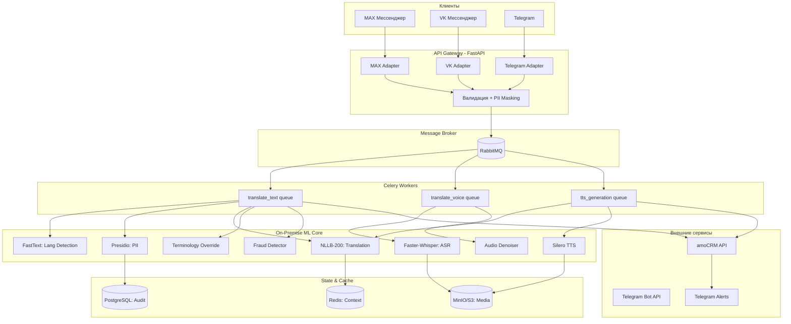
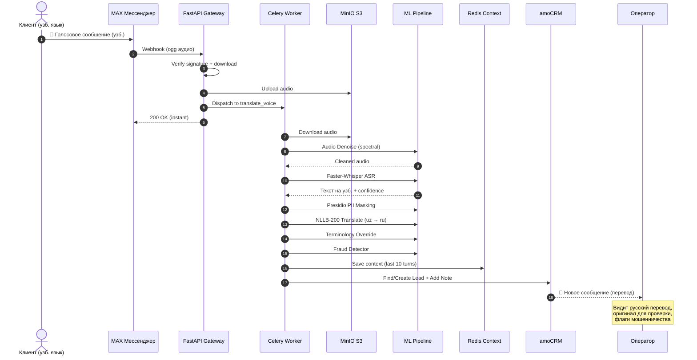

# 🌉 LinguaBridge AI Mediator

[](https://www.python.org/)
[](https://fastapi.tiangolo.com/)
[](https://docs.celeryq.dev/)
[](https://www.rabbitmq.com/)
[](https://redis.io/)
[](https://www.postgresql.org/)
[](https://github.com/facebookresearch/flores)
[](https://github.com/SYSTRAN/faster-whisper)
[](https://github.com/snakers4/silero-models)
[](https://github.com/microsoft/presidio)
[](https://docs.pydantic.dev/latest/)
[](https://www.docker.com/)

**Защищенный омниканальный AI-медиатор для мгновенного двунаправленного перевода диалогов.** 
Система устраняет языковые барьеры между русскоязычными операторами (amoCRM) и клиентами в Telegram, VK и MAX, обеспечивая рост пропускной способности КЦ в 3 раза при строгом соблюдении 152-ФЗ.

---

## 📖 О проекте

**LinguaBridge AI Mediator** — это событийно-ориентированная MLOps-платформа, которая в реальном времени переводит текстовые и голосовые сообщения между клиентами (мигрантами, говорящими на узбекском, таджикском, киргизском, китайском и других языках) и русскоязычными операторами контакт-центра.

**Описание конечной системы:**
Система представляет собой асинхронный, событийно-ориентированный шлюз (Mediation Layer), который встраивается между мессенджерами клиентов (Telegram, VK, мессенджер MAX) и интерфейсом оператора в amoCRM. 

Система в реальном времени перехватывает текстовые и голосовые сообщения, автоматически определяет язык, транскрибирует речь (при необходимости), маскирует персональные данные (PII), выполняет двунаправленный машинный перевод с учетом отраслевой терминологии и доставляет результат оператору. Ответ оператора проходит обратный цикл: перевод на язык клиента, (опционально) синтез речи (TTS) и доставка в мессенджер. Система работает по принципу **Human-in-the-Loop**: AI не принимает решений, а лишь устраняет языковой барьер.

**Ключевые возможности:**
- 🔄 **Real-time Translation:** Задержка текста < 1.5 сек, голоса < 4 сек (P95)
- 🔒 **Security First:** On-premise NLLB-200 + Faster-Whisper. Данные не покидают контур РФ
- 🛡️ **PII Masking:** Автоматическое сокрытие паспортов, карт и телефонов через Microsoft Presidio
- 🧠 **Smart Context:** Учет последних 10 реплик и кастомный словарь терминов (миграционное право, ЖКХ)
- 🚨 **Fraud Detection:** Эвристический анализ на наличие маркеров социальной инженерии
- 🎤 **Noise Reduction:** Спектральное шумоподавление для голосовых с улицы/стройки (WER -15%)
- 📞 **Voice-to-Voice:** Полный цикл ASR → Translate → TTS с конвертацией в `.ogg` (Opus)
- 🏢 **amoCRM Integration:** Богатые примечания, теги и Circuit Breaker для защиты от сбоев CRM
- 🔄 **Self-Improving:** Еженедельный LoRA Fine-Tuning на исправлениях операторов
- 📊 **Full Observability:** OpenTelemetry, Prometheus-метрики, алерты в Telegram

**Бизнес-задача:**
1. **Расширение рынка:** Обеспечение поддержки клиентов, не владеющих русским языком (таджикский, узбекский, киргизский, китайский), без найма дорогостоящих штатных переводчиков.
2. **Рост производительности:** Увеличение пропускной способности одного оператора с 1-2 до 3-4 параллельных диалогов за счет устранения задержек на ручной перевод.
3. **Снижение операционных рисков:** Автоматическое выявление маркеров мошенничества или нарушения регламентов в переписке на иностранных языках.
4. **Соблюдение 152-ФЗ:** Полный отказ от передачи голосовых и текстовых данных клиентов в публичные зарубежные облачные сервисы перевода.

---

## 🏗️ Архитектура системы

### 1. Высокоуровневая архитектура компонентов



### 2. Поток данных: от сообщения клиента до карточки оператора

```mermaid
graph LR
    A["📜 Клиент пишет на узбекском"] --> B{Channel Adapter}
    B --> C{PII Masking}
    C -->|Presidio| D["🔒 Текст с [ПАСПОРТ_СКРЫТ]"]
    D --> E{FastText Lang Detect}
    E --> F["🌐 Определен язык: uz"]
    F --> G{Celery Queue}
    G -->|text| H[NLLB-200 Translate]
    G -->|voice| I[Faster-Whisper ASR]
    I --> J[Audio Denoise]
    J --> H
    H --> K[Terminology Override]
    K --> L[Fraud Detector]
    L --> M{amoCRM Integration}
    M --> N["📝 Примечание + Теги"]
    N --> O["👤 Оператор видит перевод"]
    
    style L fill:#fff3cd,stroke:#856404
    style N fill:#d4edda,stroke:#28a745
```



### 3. Sequence Diagram: Жизненный цикл голосового сообщения



---

## 📚 Карта документации

Проект обладает исчерпывающей, поэтапной документацией. Используйте ссылки ниже для перехода к нужному уровню детализации.

### 📋 Общее описание и стратегия

| Документ | Описание |
| :--- | :--- |
| 📄 **[specification.md](specification.md)** | Полное Техническое Задание: бизнес-цели, KPI, функциональные/нефункциональные требования, стек. |
| 🗺️ **[phases.md](phases.md)** | Высокоуровневая дорожная карта (Roadmap) реализации проекта. |
| 🌳️ **[structure.md](structure.md)** | Структура (дерево) файлов реализации всего проекта. |
| 🔍 **[review.md](review.md)** | **Architecture Review:** Аудит кода, список улучшений для Enterprise-уровня (DI, MLflow, K8s Hardening, LLM-as-a-Judge). |

### 🏗️ Этап 1: Инфраструктура, Ingestion и Детекция языка

| Документ | Описание |
| :--- | :--- |
| 📦 **[phase_1_step_1.md](phase_1_step_1.md)** | Базовая инфраструктура: Docker Compose, PostgreSQL, Redis, RabbitMQ, MinIO, Celery с приоритетными очередями, Pydantic-модели. |
| 🔌 **[phase_1_step_2.md](phase_1_step_2.md)** | Мультиканальный Ingestion через паттерн **Channel Adapter**: FastAPI-роутеры и клиенты для **MAX → VK → Telegram**. |
| 🧠 **[phase_1_step_3.md](phase_1_step_3.md)** | Мгновенная детекция языка через **FastText** и базовое PII-маскирование через **Microsoft Presidio** с кастомными паттернами для РФ. |

### 🤖 Этап 2: Локальный ML-пайплайн (NLLB + Whisper)

| Документ | Описание |
| :--- | :--- |
| 🌐 **[phase_2_step_1.md](phase_2_step_1.md)** | Развертывание и оптимизация **NLLB-200-distilled-600M**: 8-bit квантование, async-обертка, маппинг low-resource языков. |
| 🎤 **[phase_2_step_2.md](phase_2_step_2.md)** | Интеграция **Faster-Whisper** для ASR: VAD-фильтр шума, int8-квантование, обработка голосовых от MAX/VK/Telegram. |
| 📖 **[phase_2_step_3.md](phase_2_step_3.md)** | Движок **Terminology Override** на базе **Aho-Corasick** для пост-обработки перевода отраслевыми терминами. |

### 🏢 Этап 3: Интеграция с amoCRM и Управление контекстом

| Документ | Описание |
| :--- | :--- |
| 🛡️ **[phase_3_step_1.md](phase_3_step_1.md)** | Асинхронный клиент **amoCRM** с **Circuit Breaker** (pybreaker), обработка скрытых ошибок 200 OK. |
| 💾 **[phase_3_step_2.md](phase_3_step_2.md)** | Управление контекстом диалога в **Redis**: хранение последних 10 реплик с TTL 24ч, Pydantic-модели. |
| 🎨 **[phase_3_step_3.md](phase_3_step_3.md)** | Форматирование вывода для оператора: Markdown-примечания в amoCRM с алертами, тегами и ссылками на оригинал. |

### 🎙️ Этап 4: Голосовой тракт, TTS и Безопасность

| Документ | Описание |
| :--- | :--- |
| 🔊 **[phase_4_step_1.md](phase_4_step_1.md)** | Интеграция **Silero TTS** для ответов + конвертация `.wav` → `.ogg` (Opus) через **FFmpeg** для мессенджеров. |
| 🚨 **[phase_4_step_2.md](phase_4_step_2.md)** | Эвристический **Fraud Detector** на Aho-Corasick с весами для выявления социальной инженерии. |
| 🔇 **[phase_4_step_3.md](phase_4_step_3.md)** | Продвинутое шумоподавление через **noisereduce** (спектральный метод) для снижения WER на 10-15%. |

### 🚀 Этап 5: Production Hardening и Fine-Tuning

| Документ | Описание |
| :--- | :--- |
| 🎓 **[phase_5_step_1.md](phase_5_step_1.md)** | Пайплайн **LoRA Fine-Tuning** для NLLB: извлечение "золотого датасета" из исправлений операторов в amoCRM, Canary Deployment. |
| 📊 **[phase_5_steps_2_3.md](phase_5_steps_2_3.md)** | **Observability** (OpenTelemetry + Prometheus + алерты) и **Нагрузочное тестирование** через Locust. |

---

## 🛠️ Технологический стек

### Ядро и Инфраструктура
- **Python 3.12** — базовый язык с нативной async/await поддержкой
- **FastAPI** — асинхронный веб-фреймворк для webhook-ов
- **Celery 5.3+** + **RabbitMQ** — распределенная очередь задач с приоритетами
- **Redis 7** — хранение контекста диалогов и кэшей
- **PostgreSQL 15** — неизменяемый аудит-лог переводов
- **MinIO / S3** — объектное хранилище для аудио с 7-дневным lifecycle
- **Docker Compose** — локальная разработка и тестирование

### ML и NLP
- **NLLB-200-distilled-600M** (Meta) — локальный машинный перевод (200 языков)
- **Faster-Whisper large-v3-turbo** — высокоскоростной ASR с VAD
- **Silero TTS v4** — синтез речи на русском и английском
- **FastText lid.176** — детекция языка за < 5 мс
- **Microsoft Presidio** + **spaCy ru_core_news_sm** — PII-маскирование
- **noisereduce + librosa** — спектральное шумоподавление
- **pyahocorasick** — сверхбыстрый поиск терминов и fraud-паттернов
- **PEFT + LoRA** — эффективное дообучение моделей

### Интеграции
- **MAX Мессенджер** (dev.max.ru) — приоритетный канал
- **VK Мессенджер** — через Callback API
- **Telegram Bot API** — через Webhook
- **amoCRM** — через REST API v4 с Circuit Breaker

### Observability и MLOps
- **OpenTelemetry** — трассировка и метрики
- **Prometheus + Grafana** — мониторинг и дашборды
- **Locust** — нагрузочное тестирование
- **Pydantic V2** — строгая типизация и валидация
- **structlog** — структурированные логи с контекстом

---

## ⚡ Быстрый старт (Local Development)

### 1. Клонирование и установка зависимостей
```bash
git clone <repository-url>
cd linguabridge
poetry install
```

### 2. Подготовка моделей и конфигурации
```bash
# Скачать модель FastText для 176 языков
wget https://dl.fbaipublicfiles.com/fasttext/supervised-models/lid.176.bin -O app/ml/lid.176.bin

# Скачать модель spaCy для русского (для Presidio)
poetry run python -m spacy download ru_core_news_sm

# Создать .env на основе шаблона
cp .env.example .env
# Отредактировать .env: добавить токены MAX, VK, Telegram, amoCRM
```

### 3. Запуск инфраструктуры
```bash
docker compose up -d
docker compose ps  # Все сервисы должны быть healthy
```

Проверьте доступность UI:
- **RabbitMQ Management:** http://localhost:15672 (guest/guest)
- **MinIO Console:** http://localhost:9001 (minioadmin/minioadmin)

### 4. Запуск приложения
```bash
# В терминале 1: FastAPI
poetry run uvicorn app.main:app --reload --port 8000

# В терминале 2: Celery Workers
poetry run celery -A app.core.celery_app worker \
    --loglevel=info --concurrency=2 \
    -Q translate_text,translate_voice,tts_generation
```

### 5. Тестирование
```bash
# Unit-тесты
poetry run pytest tests/ -v

# Инфраструктурный тест
poetry run python test_infra.py

# Тест адаптеров каналов
poetry run python test_adapters.py

# Нагрузочное тестирование
poetry run locust -f load_tests/locustfile.py --host=http://localhost:8000
```

---

## 🔒 Безопасность и Комплаенс (152-ФЗ)

Проект спроектирован с учетом строгих требований к обработке персональных данных:

1. **Zero-Trust к LLM:** Модуль `presidio` является *обязательным и неотключаемым* шагом в DAG. Сырые логи с PII никогда не покидают периметр очистки.
2. **Defense in Depth:** После Presidio текст дополнительно проверяется строгими Regex-паттернами для РФ (СНИЛС, ИНН, Паспорт, Миграционная карта).
3. **On-Premise ML:** Все модели (NLLB, Whisper, Silero, FastText) работают локально. Голосовые и текстовые данные не уходят в западные облака.
4. **Безопасное хранение:** Сырые аудиофайлы в S3 автоматически удаляются через 7 дней (Lifecycle Policy).
5. **Неизменяемый аудит:** Все переводы логируются в PostgreSQL с привязкой к `trace_id`, `channel` и `user_id`.
6. **Fraud Protection:** Эвристический детектор выявляет маркеры социальной инженерии и предупреждает оператора.

---

## 📊 Бизнес-метрики (KPI)

| Метрика | Целевое значение |
| :--- | :--- |
| **Translation Latency (Text)** | < 1.5 сек (P95) |
| **Translation Latency (Voice)** | < 4.0 сек (P95) |
| **Entity Translation Accuracy** | > 95% |
| **Operator Concurrent Chats** | 3-4 чата (рост в 3 раза) |
| **WER (Word Error Rate)** | < 15% (после шумоподавления) |
| **Fraud Detection Precision** | > 85% |

---

## 🚦 Статус проекта

✅ **Архитектура и дизайн:** Завершены  
✅ **Детальная спецификация (Этапы 1-5):** Завершены  
✅ **Кодовая база (Core Pipeline):** Реализована, покрыта unit-тестами  
✅ **ML-пайплайн:** NLLB-200, Faster-Whisper, Silero TTS, FastText, Presidio  
✅ **Интеграции:** MAX, VK, Telegram, amoCRM  
✅ **Production Hardening:** Observability, Load Testing, LoRA Fine-Tuning  

**Рекомендуемый следующий шаг:** Ознакомьтесь с файлом **[review.md](review.md)**, где содержатся критически важные архитектурные рекомендации (внедрение DI-контейнера `dishka`, MLflow для трекинга экспериментов, K8s GPU-планирование, Alembic для миграций) для перевода системы в состояние "High-Load Enterprise Production".
