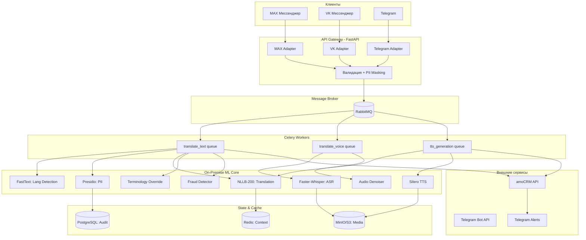
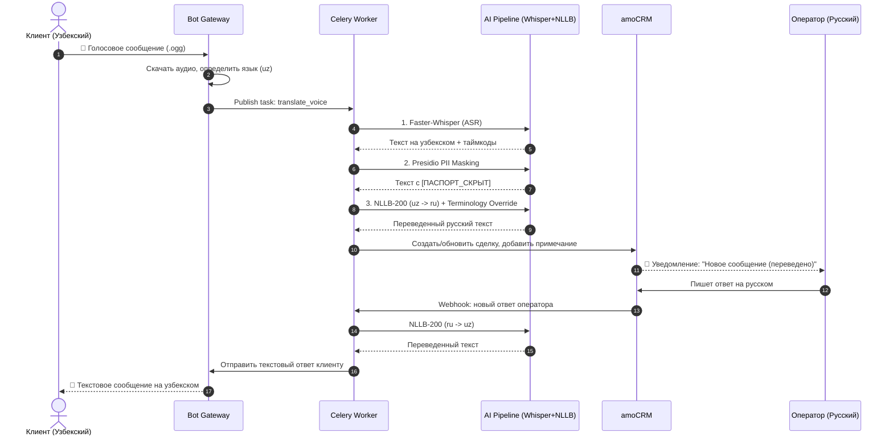

# ТЕХНИЧЕСКОЕ ЗАДАНИЕ (ТЗ)
**Наименование системы:** Мультиязычный AI-медиатор для омниканальной поддержки (Migrant Support Translator)  
**Версия документа:** 1.0  
**Целевая аудитория:** Трудовые мигранты (клиенты), русскоязычные операторы КЦ, супервайзеры, служба безопасности.

---

## 1. Описание конечной системы
Система представляет собой асинхронный, событийно-ориентированный шлюз (Mediation Layer), который встраивается между мессенджерами клиентов (Telegram, VK, мессенджер MAX) и интерфейсом оператора в amoCRM. 

Система в реальном времени перехватывает текстовые и голосовые сообщения, автоматически определяет язык, транскрибирует речь (при необходимости), маскирует персональные данные (PII), выполняет двунаправленный машинный перевод с учетом отраслевой терминологии и доставляет результат оператору. Ответ оператора проходит обратный цикл: перевод на язык клиента, (опционально) синтез речи (TTS) и доставка в мессенджер. Система работает по принципу **Human-in-the-Loop**: AI не принимает решений, а лишь устраняет языковой барьер.

---

## 2. Бизнес-задача
1. **Расширение рынка:** Обеспечение поддержки клиентов, не владеющих русским языком (таджикский, узбекский, киргизский, китайский), без найма дорогостоящих штатных переводчиков.
2. **Рост производительности:** Увеличение пропускной способности одного оператора с 1-2 до 3-4 параллельных диалогов за счет устранения задержек на ручной перевод.
3. **Снижение операционных рисков:** Автоматическое выявление маркеров мошенничества или нарушения регламентов в переписке на иностранных языках.
4. **Соблюдение 152-ФЗ:** Полный отказ от передачи голосовых и текстовых данных клиентов в публичные зарубежные облачные сервисы перевода.

---

## 3. Бизнес-метрики (KPI)
| Метрика | Описание | Целевое значение |
| :--- | :--- | :--- |
| **Translation Latency (Text)** | Время от получения сообщения в мессенджере до появления перевода в amoCRM (P95). | **< 1.5 сек** |
| **Translation Latency (Voice)** | Полное время обработки голосового сообщения (ASR + Translate + TTS). | **< 4.0 сек** |
| **Entity Translation Accuracy** | Точность перевода ключевых сущностей (номера документов, суммы, адреса) без искажений. | **> 95%** |
| **Operator Concurrent Chats** | Среднее количество активных диалогов у одного оператора. | **3-4 чата** |
| **WER (Word Error Rate)** | Ошибка распознавания речи для голосовых сообщений (после постобработки). | **< 15%** |

---

## 4. Требования

### 4.1. Функциональные требования
1. **Автодетекция языка:** Мгновенное определение языка входящего сообщения (поддержка: tg, uz, ky, zh, en, ru).
2. **Двунаправленный перевод:** 
   - Клиент (ин. язык) → AI → Оператор (русский).
   - Оператор (русский) → AI → Клиент (ин. язык).
3. **Terminology Override:** Пост-обработка перевода через кастомный словарь для корректной передачи терминов ("патент", "РВП", "миграционный учет", "СБП").
4. **Голосовой тракт:** Поддержка голосовых сообщений: ASR (Faster-Whisper) → Перевод → (опционально) TTS (Silero) для ответа клиенту.
5. **Управление контекстом:** Хранение последних 10 реплик диалога в Redis для корректного разрешения местоимений и контекста при переводе.
6. **Детектор аномалий:** Эвристическая или LLM-проверка текста на наличие маркеров мошенничества ("переведи на карту", "решу вопрос с полицией").

### 4.2. Нефункциональные требования
1. **Масштабируемость:** Асинхронная обработка через Celery с возможностью горизонтального масштабирования воркеров при пиковых нагрузках.
2. **Отказоустойчивость:** При падении локальной модели NLLB-200 система автоматически переключается на резервный облачный API (Yandex Translate) с сохранением трассировки.
3. **Наблюдаемость:** Сквозная трассировка (OpenTelemetry) каждого сообщения для замера задержек на каждом этапе (ASR, Translate, CRM API).

### 4.3. Требования безопасности и РФ-специфика (152-ФЗ)
1. **On-Premise ML:** Модели NLLB-200 и Faster-Whisper развернуты на защищенных серверах в контуре РФ. Данные не покидают периметр.
2. **PII Masking:** Интеграция `Microsoft Presidio` для маскирования номеров паспортов, телефонов и карт *до* того, как текст увидит оператор или попадет в логи.
3. **Аудит:** Неизменяемое логирование пар "оригинал → перевод" в PostgreSQL для разбора спорных ситуаций и претензий.

---

## 5. Архитектура системы

### 5.1. Высокоуровневая архитектура (Component Diagram)

### 5.2. Sequence Diagram: Обработка голосового сообщения

---

## 6. Детальные этапы реализации

### Этап 1: Инфраструктура, Ingestion и Детекция языка (Недели 1-2)
*Цель: Создать надежный шлюз приема сообщений и определить язык до начала тяжелой обработки.*
- **Подзадача 1.1:** Развертывание базовой инфраструктуры: Docker Compose с PostgreSQL, Redis, RabbitMQ (для Celery).
- **Подзадача 1.2:** Реализация асинхронных ботов (`aiogram 3.x` для TG, `vk_api` для VK). Настройка Webhook-ов, скачивание медиафайлов во временное хранилище (S3/MinIO).
- **Подзадача 1.3:** Интеграция `fasttext` (модель `lid.176.bin`) для сверхбыстрой (< 50 мс) детекции языка входящего текста.
- **Подзадача 1.4:** Реализация базового PII-маскирования (`presidio-analyzer`) для блокировки отправки сырых данных в логи.
- **Критерии приемки:** Бот принимает текст/аудио, определяет язык с точностью > 98%, ставит задачу в Celery, маскирует явные ПДн.

### Этап 2: Локальный ML-пайплайн (NLLB + Whisper) (Недели 3-4)
*Цель: Обеспечить качественный и быстрый перевод без выхода в публичные облака.*
- **Подзадача 2.1:** Развертывание `NLLB-200` (модель `nllb-200-distilled-600M` для баланса скорости и качества) через `transformers` с квантованием (`bitsandbytes` 8-bit) для экономии VRAM.
- **Подзадача 2.2:** Интеграция `Faster-Whisper` (модель `medium` или `large-v3-turbo` с `compute_type="int8"`) для транскрибации голосовых с параметром `vad_filter=True`.
- **Подзадача 2.3:** Реализация слоя **Terminology Override**: пост-процессинг переведенного текста через алгоритм Aho-Corasick или Regex для принудительной замены общих слов на утвержденные отраслевые термины (например, замена "разрешение на работу" на "патент", если это соответствует контексту).
- **Критерии приемки:** Задержка перевода текста < 800 мс, голосового сообщения < 3 сек. Корректная работа словаря терминов.

### Этап 3: Интеграция с amoCRM и Управление контекстом (Недели 5-6)
*Цель: Бесшовно встроить переводчика в рабочий процесс оператора.*
- **Подзадача 3.1:** Реализация асинхронного клиента `amocrm-api` (через `httpx`). Маппинг входящих сообщений: если контакт существует, обновление сделки; если нет – создание нового Лида с тегом "Migrant_Lang_XX".
- **Подзадача 3.2:** Реализация **Context Window Management** в Redis. Сохранение последних 10 пар "вопрос-ответ" для передачи в NLLB в виде Few-Shot примеров, что критически улучшает качество перевода местоимений и разговорных фраз.
- **Подзадача 3.3:** Визуальное разделение в amoCRM: в примечании к сделке отображать блок: `[Оригинал: tg] ... [Перевод: ru]`, чтобы оператор мог проверить корректность в спорных ситуациях.
- **Критерии приемки:** Сообщения появляются в amoCRM < 1.5 сек. Контекст диалога сохраняется при перезапуске бота.

### Этап 4: Голосовой тракт, TTS и Безопасность (Недели 7-8)
*Цель: Полноценная поддержка голосового общения и защита от рисков.*
- **Подзадача 4.1:** Интеграция `Silero TTS` для генерации голосовых ответов на целевых языках (выбор мужского/женского голоса, настройка скорости для лучшей разборчивости).
- **Подзадача 4.2:** Реализация эвристического **Fraud Detector**: проверка переведенного текста на наличие триггерных фраз ("переведи на карту", "код из смс", "безопасный счет"). При срабатывании – пометка сообщения в amoCRM красным флагом и уведомление супервайзера.
- **Подзадача 4.3:** Настройка шумоподавления для ASR (интеграция `RNNoise` или использование встроенных возможностей Faster-Whisper) для борьбы с фоновым шумом (стройка, улица).
- **Критерии приемки:** Генерация TTS < 1.5 сек. Fraud detector имеет < 5% ложных срабатываний.

### Этап 5: Production Hardening и Fine-Tuning (Недели 9-10)
*Цель: Доведение качества перевода low-resource языков до коммерческого уровня и обеспечение стабильности.*
- **Подзадача 5.1:** Сбор параллельного корпуса (пары "оригинал-перевод") из реальных диалогов за первые недели работы.
- **Подзадача 5.2:** **LoRA Fine-Tuning** модели NLLB-200 на собранном корпусе для адаптации к специфическому синтаксису и сленгу мигрантов (резко повышает качество по сравнению с base-моделью).
- **Подзадача 5.3:** Настройка автоскейлинга Celery-воркеров (KEDA или встроенный autoscaler) в зависимости от длины очереди RabbitMQ.
- **Подзадача 5.4:** Внедрение OpenTelemetry для отслеживания P95 latency на каждом шаге. Настройка алертов в Grafana: "Latency > 2s", "NLLB OOM Error".
- **Критерии приемки:** WER для голосовых снижен до < 15%. Система выдерживает 500 одновременных запросов без деградации latency.

---

## 7. Технологический стек и варианты

| Компонент | Основной вариант (Рекомендуемый) | Альтернативный вариант | Обоснование выбора |
| :--- | :--- | :--- | :--- |
| **Bot Framework** | `aiogram 3.x` (TG), `vk_api` (VK) | `python-telegram-bot` | `aiogram` имеет лучшую архитектуру для асинхронной работы с медиа и состояниями (FSM). |
| **Translation Engine** | **NLLB-200** (Meta, on-premise, distilled-600M) | **Yandex Translate API** | NLLB обеспечивает 152-ФЗ и бесплатен. Yandex API используется только как fallback при падении локального GPU. |
| **ASR (Speech-to-Text)**| **Faster-Whisper** (CTranslate2, int8) | **Yandex SpeechKit** | Faster-Whisper локален и быстр. Yandex SpeechKit рассматривается, если WER локальной модели на акцентах будет неприемлемо высоким (>20%). |
| **TTS (Text-to-Speech)** | **Silero TTS** (Open Source) | **Yandex SpeechKit TTS** | Silero бесплатен, работает локально, имеет хорошие голоса для основных языков СНГ. |
| **Context & Queue** | **Redis** + **Celery** + **RabbitMQ** | Kafka + Redis | Celery+RabbitMQ проще в настройке и идеален для паттерна "задача-результат" с гарантией доставки. |
| **CRM** | **amoCRM** (через официальный API) | Bitrix24 / Zendesk | amoCRM имеет более простой и быстрый REST API для создания сделок и примечаний в реальном времени. |
| **PII Masking** | **Microsoft Presidio** | Кастомные Regex | Presidio использует NER-модели, что критически важно для распознавания контекстных ПДн (например, отличия номера телефона от номера патента). |
| **LLM (Fraud/Context)** | **YandexGPT Pro** (Cloud, 152-ФЗ) | **Llama-3-8B** (vLLM, local) | YandexGPT дешевле и проще для эвристической проверки на мошенничество. Локальная Llama-3 нужна только при строжайших требованиях ИБ. |

---

## 8. Ключевые риски и стратегии их минимизации (Mitigation)

1. **Риск: Низкое качество NLLB для таджикского/киргизского (Low-Resource).**
   - *Mitigation:* Обязательный этап 5.2 (LoRA Fine-Tuning) на реальных данных компании. Внедрение жесткого `Terminology Override` словаря, который исправляет ключевые ошибки постфактум.
2. **Риск: Шумные голосовые сообщения (WER > 30%).**
   - *Mitigation:* Использование `vad_filter` в Faster-Whisper. Если уверенность ASR (confidence score) < 0.6, бот автоматически отвечает клиенту шаблоном: "Плохо слышно, пожалуйста, напишите текстом или перезвоните".
3. **Риск: Культурные искажения при переводе (например, неуместное "ты").**
   - *Mitigation:* Добавление в системный промпт (если используется LLM для пост-обработки) или в few-shot примеры NLLB правила: "Всегда используй вежливую форму обращения 'Вы' при переводе на русский".
4. **Риск: Утечка ПДн через логи Celery/Redis.**
   - *Mitigation:* Строгий middleware, который применяет `presidio` к *любому* тексту перед его записью в Redis или отправкой в Celery task payload.
